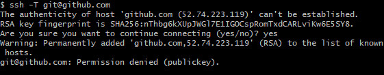
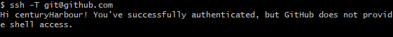
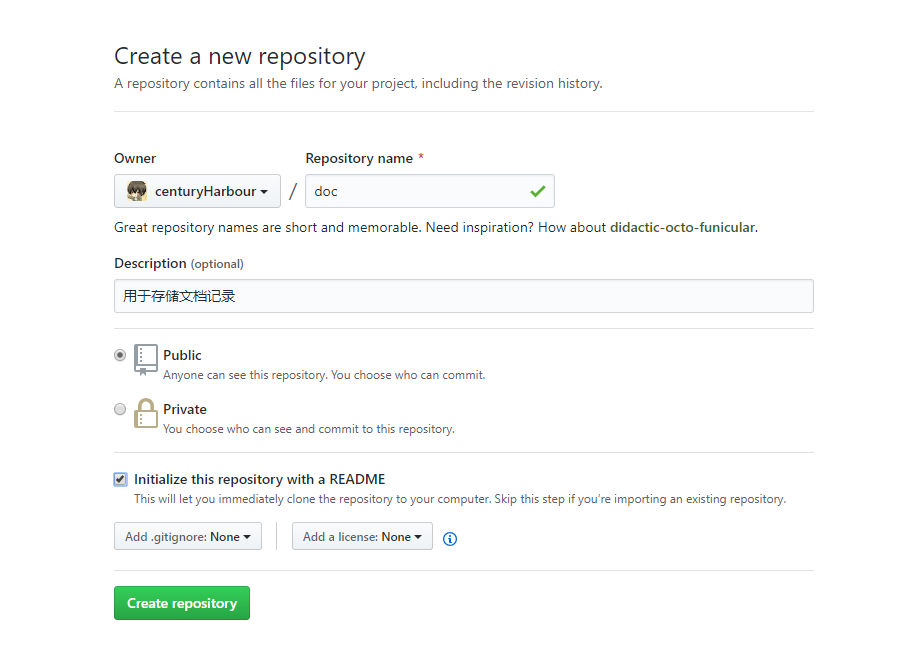

# github 常规使用

## 使用流程：

1. 申请注册 `github` 账号

2. 登录 `github` 找到头像旁边的三角形小按钮，选中 `setting` 选项，然后在新界面选中 `SSH and GPG keys` 选中

3. 点击 `new ssh key` 增加新的关联 [公钥](./sshkey.md)（用于相关设备锁定用户，使其有权限提交代码到 `github` 仓库）

4. 填写 `new ssh key`界面里的 `Title`，并把 `.ssh/id_rsa.pub` 里的内容拷贝到 `new ssh key` 界面里的 `Key` 输入框里，然后点击 `Add SSH key` 按钮即可。

5. 在终端或 `git bash` 中输入 `ssh -T git@github.com` 按回车键，若不成功则会如第一张图片般提示，若成功则如第二张图般提示。

    <br>
    

6. 在 `github` 页面中点击 `+`有三角形的按钮，找到 `new repository` 新建项目，填写如下图所示的项目名字和描述，勾选 `Initialize this repository with a README` 其他的默认即可，最后点击 `Create repository`，新项目建立就成功了

    

7. `git` 设置 `username` 和 `email` ， 因为 `github` 每次 `commit` 都需要记录。

    ```bash
    git config --global user.name "your name"
    git config --global user.email "your email"
    ```

8. 一般情况我们都是要 `clone` 我们刚才在 `github` 创建的项目下来，然后就是在该项目里编辑自己的东西就好了，若是你在本地已经有项目文件夹了，那你仅仅只要关联上 `github` 的你需要上传的项目就好了。以下是关联项目的操作：

    ```bash
    git remote add origin git@github.com:yourName/yourRepo.git（或是直接到 github 上拷贝路径）
    git remote -v （查看是否关联成功）
    ```

    *<font color=#fff566 size=3>Note:&nbsp;&nbsp;</font>* 最好添加 `.gitignore` 文

9. `git fetch` 更新远程的代码下来

10. `git add .` 保存代码

11. `git commit -m 'xxx'` 添加保存代码的描述，方便以后回退及预览

12. `git push` ，若是第一次提交的话