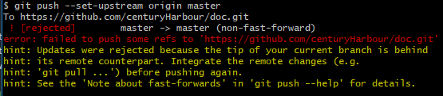

# github 常规使用

## 使用流程：

0. 如果 `github` 创建项目是全空的话，那只要（否则请从 `1` 步骤开始）： 

    1. `git remote add origin git@github.com:yourName/yourRepo.git`
    2. `git add .`
    3. `git commit -m 'xxxx'`
    4. `git push -u origin master`

1. 申请注册 `github` 账号

2. 登录 `github` 找到头像旁边的三角形小按钮，选中 `setting` 选项，然后在新界面选中 `SSH and GPG keys` 选中

3. 点击 `new ssh key` 增加新的关联 [公钥](./sshkey.md)（用于相关设备锁定用户，使其有权限提交代码到 `github` 仓库）

4. 填写 `new ssh key`界面里的 `Title`，并把 `.ssh/id_rsa.pub` 里的内容拷贝到 `new ssh key` 界面里的 `Key` 输入框里，然后点击 `Add SSH key` 按钮即可。

5. 在终端或 `git bash` 中输入 `ssh -T git@github.com` 按回车键，若不成功则会如第一张图片般提示，若成功则如第二张图般提示。

    <br>
    

6. 在 `github` 页面中点击 `+`有三角形的按钮，找到 `new repository` 新建项目，填写如下图所示的项目名字和描述，勾选 `Initialize this repository with a README` 其他的默认即可，最后点击 `Create repository`，新项目建立就成功了

    

7. `git` 设置 `username` 和 `email` ， 因为 `github` 每次 `commit` 都需要记录。

    ```bash
    git config --global user.name "your name"
    git config --global user.email "your email"
    ```

8. 一般情况我们都是要 `clone` 我们刚才在 `github` 创建的项目下来，然后就是在该项目里编辑自己的东西就好了，若是你在本地已经有项目文件夹了，那你仅仅只要关联上 `github` 的你需要上传的项目就好了。以下是关联项目的操作：

    ```bash
    git remote add origin git@github.com:yourName/yourRepo.git（或是直接到 github 上拷贝路径）
    git remote -v （查看是否关联成功）
    ```

    *<font color=#fff566 size=3>Note:&nbsp;&nbsp;</font>* 最好添加 `.gitignore` 文件（忽略文件自身，这样就在 `git status` 就不会提示自身修改的）

9.  `git fetch` 更新远程的代码下来

10. `git add .` 保存代码

11. `git commit -m 'xxx'` 添加保存代码的描述，方便以后回退及预览

12. `git push` ，若是第一次提交的话，则会提示你使用 `git push --set-upstream origin master` 命令

    *<font color=#fff566 size=3>Note:&nbsp;&nbsp;</font>* 若是出现以下示例图片情况，请使用 `git pull origin master --allow-unrelated-histories` （合并远程仓库代码），出现合并界面一般按 `shift + ;`，然后输入 `wq` 按回车键，成功后则重复10~12的步骤即可。（有可能还会出现要解冲突的情况（查看冲突文件的代码 `git status` or `git status -uno`），删除冲突文件的冲突代码或是 `git -rm --cached` '文件路径'移除已经 `add` 的文件(不删除物理文件，仅将该文件从缓存中删除)或是 `git rm --f` "文件路径"（不仅将该文件从缓存中删除，还会将物理文件删除（不会回收到垃圾桶））。具体如何解冲突请自行百度）

    

    `git rm` 的说明文档 ` git rm -h` 用法：`git rm [<选项>] [--] <文件>...`

    ```bash
    -n, --dry-run         演习
    -q, --quiet           不列出删除的文件
    --cached              只从索引区删除
    -f, --force           忽略文件更新状态检查
    -r                    允许递归删除（用于删除文件夹）
    --ignore-unmatch      即使没有匹配，也以零状态退出
    ```

    `git rm -r '文件夹路径' '文件夹路径'` 可以删除多个文件夹 `git rm '文件路径' '文件路径'` 可以删除多个文件

