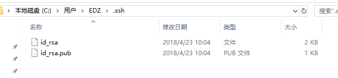

# ssh key 密钥说明

> `ssh` 可参考“[SSH的初步使用详解](http://www.findme.wang/blog/detail/id/258.html)、[SSH 秘钥Key的简介以及生成和使用](https://blog.csdn.net/hsd2012/article/details/79469747)”，密钥通常分为公钥（ `id_rsa.pub` ）和私钥（ `id_rsa` ），公钥可以自由的放在您所需要连接的 SSH 服务器上，而私钥必须的保管好。

### **密钥生成方式：**

`cmd` 命令输入 `ssh-keygen -t rsa -C "邮箱"` 按三次回车键默认即可生成密钥，生成后一般都会提示你密钥所在文件夹位置，也可以以下方式查找：

*  **`mac` 设备（以我的 `macbookpro` 为例）**

      在终端输入 `open ~/.ssh` 打开，也可以 `command + shift + g` 输入目录地址打开

* **`pc` 设备（ `windows` ）**

    `win7` 一般是在 `Administrator/.ssh(C:\Users\Administrator\.ssh)` 可以找到，而 `win10` 一般是在 `C:\Users\EDZ\.ssh` 里能找到
