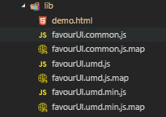

# npm包的cdn引用

> 一般发布了npm包后，我们都可能会有cdn引用该包的需求

 

## **使用方法**

* [unpkg](https://unpkg.com/)

  > 使用格式 `unpkg.com/:package@:version/:file`，例如：我发布的是favour-ui的包，文件目录是如下图所示，所以地址为： `https://unpkg.com/favour-ui@0.0.1/lib/demo.html`

   

  

* [jsdelivr](https://cdn.jsdelivr.net)

  > 使用格式 `https://cdn.jsdelivr.net/npm/package@version/file`，例如：我发布的是favour-ui的包，文件目录是如下图所示，所以地址为： `https://cdn.jsdelivr.net/npm/favour-ui@0.0.1/lib/favourUI.umd.min.js`

*Note:&nbsp;&nbsp;* jsdelivr在全球都有，速度很快 [知乎参考文章](https://www.zhihu.com/question/20227463)
