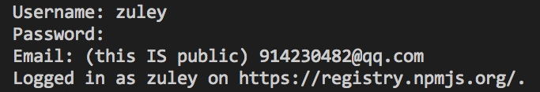
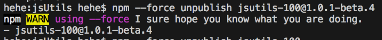
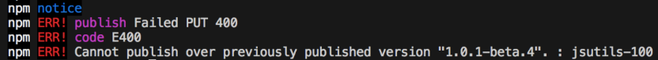

# 说明

> npm发布流程的说明文档

## 1. 初始化 `package.json`

> 配置发布到npm所需的参数字段

* `name`：包名，该名字是唯一的。可在npm官网搜索名字，如果存在则需换个名字。
* `version`：版本号，每次发布至npm需要修改版本号，不能和历史版本号相同。
* `description`：描述。
* `main`：入口文件，该字段需指向我们最终编译后的包文件。
* `keyword`：关键字，多个关键字以空格分隔，该字段为用户搜索的词。
* `author`：作者。
* `private`：是否私有，需要修改为 `false` 才能发布到 `npm`
* `license`：开源协议。（[常见开源协议](https://www.cnblogs.com/devgis/p/7727266.html)）

**`npm` 的 `package.json` 基本配置，示例如下：**

```json
{
  "name": "vcolorpicker",
  "version": "0.1.6",
  "description": "基于 Vue 的颜色选择器",
  "main": "lib/vcolorpicker.umd.min.js",
  "keyword": "vcolorpicker colorpicker color-picker",
  "private": false
}
```

## 2. 添加 `.npmignore` 文件，配置需要忽略发布的文件或目录

  > 通常发布 `npm` 包只需要编译后的文件或是目录、 `package.json` 、 `README.md`，其余的都忽略不发布。

**`npm` 的 `.npmignore` 基本配置，示例如下：**

```
# 忽略目录
public/
packages/

# 忽略指定文件
*.lock
babel.config.js
*.mpm
```

## 3. 登录 `npm` 账号（没有请到npm官网 [注册](https://www.npmjs.com/signup)）

> 这是发布 `npm` 包必须经步骤，在终端（windows系统是在 `cmd`）运行命令。

**步骤如下：**

1. 检查镜像地址是否是 `npm` 的镜像地址（http://registry.npmjs.org）：

    ```bash
    $ npm config get registry
    ```

    *Note：* 否则镜像地址请设置为npm的镜像地址，设置执行命令如下：
    
    ```bash
    $ npm config set registry http://registry.npmjs.org
    ```

2. 配置 `npm` 账号、密码和邮箱（用于接收发布或删除等操作 `npm` 包的提示邮件）：

    ```bash
    $ npm login
    ```
    

3. 发布至 `npm`

    ```bash
    $ npm publish
    ```

    若是带有 [作用域](./npm包名规范.md) 的npm包，执行命令则是如下所示：

    ```bash
    $ npm publish --access=public
    ```

4. 撤销发布包

    > 撤销发布包有诸多限制：

    * 根据规范，只有在法宝的24小时内才允许撤销发布包
    * 即使你撤销了发布的包，法宝的时候也不能再和被撤销的包的名称和把本重复了（即不能名称相同，版本相同，因为这两者构成的唯一标识已经被占用了）

    *Like：* 
    
    * *step1：* 刚刚发布的jsutils-100@1.0.1-beta.4其实是我用来测试的，里面并没有修改任何code，现在进行一下撤销，如下图：

    

    * *step2：* 重新发布jsutils-100@1.0.1-beta.4版本的包就会报如下错误提示：

    