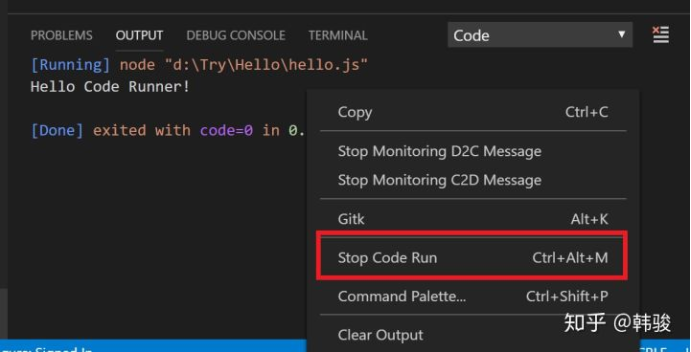

# Code Runner 插件说明

> 用于运行各类编程语言的代码，甚至是代码片段，支持了 `Node.js` ， `Python` ， `C++` ， `Java` ， `PHP` ， `Perl` ， `Ruby` ， `Go` 等超过40种的语言。

 

*Use:&nbsp;&nbsp;* 打开你要运行的文件，可以使用以下方式运行文件：

  * 键盘快捷键 `Ctrl+Alt+N`

  * 快捷键 `F1` 调出命令面板, 然后输入 `Run Code`
  
  * 在编辑区，右键选择 `Run Code`

  * 在左侧的文件管理器，右键选择 `Run Code`

  * 右上角的运行小三角按钮

 

 

*Stop:&nbsp;&nbsp;* 停止代码运行，可以使用以下方式：

  * 键盘快捷键 `Ctrl+Alt+M`
  * 快捷键 `F1` 调出 命令面板, 然后输入 `Stop Code Run`
  * 在 `Output Channel` ，右键选择 `Stop Code Run`

 

 

**参考文章：**

  * [Code Runner: 代码一键运行，支持超过40种语言](https://zhuanlan.zhihu.com/p/54861567)